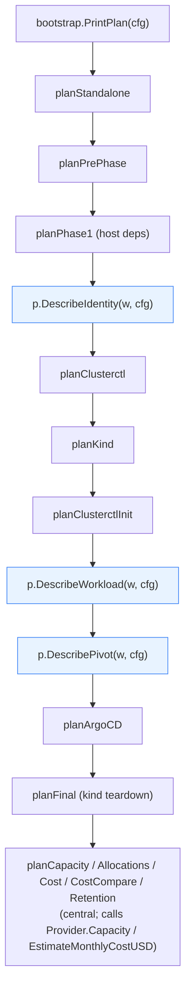

# Provider abstraction — analysis + plan

bootstrap-capi was originally a Proxmox-only Go port of a bash
script. The pluggable `provider.Provider` interface (12 providers
registered today) covers the *peripheral* CAPI bits — clusterctl
init args, K3s template, identity bootstrap, CSI Secret, cost
estimator. The *core orchestration* still hardcodes Proxmox in
several places. This document maps the bindings and proposes a
phased extraction.

## 1. Where Proxmox is currently bound

Numbers below are reference counts as of HEAD. They're indicative,
not authoritative — the analysis is what matters.

### 1a. Hard bindings outside the proxmox provider package

| File                                      | Mentions | What it does                                                                 |
|-------------------------------------------|---------:|------------------------------------------------------------------------------|
| `internal/bootstrap/bootstrap.go`         | 129      | `Run()` orchestrator: identity, kind→mgmt sync, manifest patching, pivot     |
| `internal/bootstrap/plan.go`              |  34      | Dry-run plan body: phase 2.0 / 2.9 / 2.95 are written for Proxmox            |
| `internal/bootstrap/admin.go`             |  35      | Proxmox admin-API helpers (pool create, etc.)                                |
| `internal/bootstrap/purge.go`             |  12      | `--purge` flow (Terraform state, BPG provider tree, CSI configs)             |
| `internal/bootstrap/workloadapps.go`      | (some)   | App-of-apps wiring                                                           |
| `internal/pivot/{pivot,wait,move,manifest}.go` |  44 | clusterctl move: kind → Proxmox mgmt cluster                                 |
| `internal/kindsync/*`                     | 174      | The `proxmox-bootstrap-config/config.yaml` Secret, BPG cred handoff          |
| `internal/capacity/capacity.go`           | (whole)  | Hits Proxmox `/api2/json/cluster/resources` directly                         |
| `internal/capimanifest/{k3s,patches}.go`  | (some)   | ProxmoxMachineTemplate-shaped patches; K3s template embeds Proxmox CRDs      |
| `internal/wlargocd/render.go`             |  some    | App-of-apps overlay names                                                    |
| `internal/yamlx/yamlx.go`                 |  some    | YAML extraction helpers used by Proxmox patches                              |
| `internal/caaph/caaph.go`                 |  some    | Helm values rendering for Proxmox CSI                                        |

### 1b. Config bindings

`internal/config/config.go`: **83 fields** prefixed `Proxmox*`
(URL, Token, Secret, AdminUsername, AdminToken, Node, Pool,
TemplateID, CSIStorage, CSIChartName, CAPIUserID, IdentitySuffix,
…). All read from `PROXMOX_*` env or `--proxmox-*` flags. Treated
as first-class top-level config rather than namespaced under a
provider.

### 1c. CLI bindings

`internal/cli/parse.go` + `usage.txt`: dozens of `--proxmox-*` /
`--admin-*` flags presented as if they were universal program
flags. Other-cloud flags exist (`--aws-mode`, `--azure-location`,
…) but live alongside as peers. There is no `--infra-provider` /
`--infrastructure-provider` flag — the active provider is set only
via `INFRA_PROVIDER` env, which is itself surprising.

### 1d. Capacity bindings

`internal/capacity/capacity.go` directly calls Proxmox endpoints:
- `/api2/json/cluster/resources?type=node` — host totals
- `/api2/json/cluster/resources?type=storage` — storage backends
- `/api2/json/cluster/resources?type=vm` — existing-VM census

`bootstrap.go` and `plan.go` call `capacity.FetchHostCapacity` and
`capacity.FetchExistingUsage` directly — bypassing the
`Provider.Capacity` method that already exists on the interface.

### 1e. Identity bindings

`internal/opentofux/` is purely Proxmox: it generates the BPG
Terraform tree, applies/recreates the CAPI + CSI users. The
`Provider.EnsureIdentity` interface method exists and the proxmox
provider's implementation correctly delegates here. AWS / Azure /
GCP / etc. would each need their own identity-bootstrap layer.

### 1f. Pivot bindings

`internal/pivot/` runs `clusterctl move` from kind → a Proxmox-
hosted management cluster. The shape generalizes (kind → any
managed cluster) but the text and many details are Proxmox-flavored.

## 2. What's already abstracted

The `Provider` interface (`internal/provider/provider.go`) covers:

- `Name()`, `InfraProviderName()`
- `EnsureIdentity(cfg) error`
- `Capacity(cfg) (*HostCapacity, error)`
- `EnsureGroup(cfg, name) error`
- `ClusterctlInitArgs(cfg) []string`
- `K3sTemplate(cfg, mgmt) (string, error)`
- `PatchManifest(cfg, manifestPath, mgmt) error`
- `EnsureCSISecret(cfg, kubeconfigPath) error`
- `EstimateMonthlyCostUSD(cfg) (CostEstimate, error)`

The `provider.MinStub` helper short-circuits the boring bits for
cost-only providers.

What's **missing** from this interface relative to what `Run()`
actually does:

1. **Existing-resource census** (corollary to `Capacity`). Today
   `capacity.FetchExistingUsage` is Proxmox-only. Needs a
   `Provider.ExistingUsage(cfg) (*ExistingUsage, error)` — or fold
   into `Capacity`.
2. **Plan-section content**. The dry-run prints provider-specific
   text like "Proxmox templates: control-plane=104, worker=104" or
   "Cilium HCP …" or "Proxmox CSI on workload …". Should be
   delegated to `Provider.DescribePlan(w, cfg)` — each provider
   prints its own relevant sections.
3. **Kind→mgmt config persistence** (`kindsync`). Today the kind
   Secret is keyed `proxmox-bootstrap-config` and contains
   Proxmox-specific fields. Needs to be neutral (`bootstrap-config`
   namespace, generic schema) with a per-provider Secret extension.
4. **Purge** (`--purge`). Today purges Terraform state + Proxmox
   admin tree. Needs `Provider.Purge(cfg) error` for cloud-specific
   cleanups (e.g. AWS = delete the IAM stack we created in
   `EnsureIdentity`; Hetzner = no-op).
5. **Manifest generation**. `internal/capimanifest` currently
   emits CAPI manifests assuming Proxmox-flavored variables. The
   per-provider `K3sTemplate` + `PatchManifest` already cover most
   of this; what remains is the *value substitution* (which env
   vars get plugged in) — generalize via `Provider.TemplateVars(cfg)
   map[string]string`.
6. **Admin/auth bootstrap helpers** (`bootstrap/admin.go`):
   pool/group/folder creation that runs against the cloud-control
   API. `Provider.EnsureGroup` already exists; the orchestrator
   just needs to delegate consistently.

## 3. Plan — phased extraction

Don't do this in one mega-PR. Five phases, each shippable:

### Phase A — Inventory behind the interface

**Goal:** kill the direct `capacity.Fetch*` calls in
`bootstrap.go` / `plan.go`. Provider becomes the single point of
truth for "what's there + what's free on this cloud" — and the
provider, not the orchestrator, owns the math that turns raw
capacity into cloud-correct available headroom.

Steps:

1. Replace the existing `Provider.Capacity` method with a single
   `Inventory` method (see §10 spec):
   ```go
   Inventory(cfg *config.Config) (*Inventory, error)
   ```
   Define `Inventory`, `ResourceTotals` in `internal/provider/`
   (or a shared sub-package to avoid import cycles).
2. Move `FetchHostCapacity` + `FetchExistingUsage` out of
   `internal/capacity` into `internal/provider/proxmox/` as
   private helpers. Combine them inside the proxmox provider's
   `Inventory()` — one outbound batch, returns Total + Used +
   Available (Proxmox computes Available = Total − Used; trivial
   for a flat pool).
3. Replace direct calls in `bootstrap.go` / `plan.go` with a
   single `provider.For(cfg).Inventory(...)`. Preflight checks
   `inv.Available`; plan output reads `inv.Total` and `inv.Used`.
4. Other providers return `ErrNotApplicable` from `Inventory`
   until each implements its own (AWS Service Quotas, GCP Compute
   Engine quotas, Hetzner per-project caps, etc.).

**Risk:** low. Mechanical refactor; existing tests still cover the
math.

**Estimated size:** ~400 LOC moved, ~50 LOC of new wiring.

### Phase B — Plan body delegation

**Goal:** kill the Proxmox-specific bullets in
`bootstrap/plan.go`. Each provider prints its own sections.

Steps:

1. Add to `Provider`:
   ```go
   DescribePlan(w PlanWriter, cfg *config.Config)
   ```
   `PlanWriter` is a small interface (just `Section(title string)` +
   `Bullet(format string, args ...any)` + `Skip(reason string)`)
   defined in `internal/bootstrap` or a sibling. Keeps the visual
   style consistent across providers.
2. `bootstrap.planForProvider(w, cfg)` calls
   `provider.For(cfg).DescribePlan(w, cfg)`.
3. Move the Proxmox-specific bullets into
   `internal/provider/proxmox/plan.go`. AWS gets its own
   `internal/provider/aws/plan.go` (currently it has none — and
   that's why `--dry-run` on AWS shows Proxmox phases today).
4. Cross-cutting sections that are provider-agnostic stay in
   `bootstrap/plan.go`: capacity verdict, allocations, cost,
   cost-compare, retention, taller note.

**Risk:** medium. Each provider needs to know what its phases
look like. AWS today has none — this phase is also where AWS
finally gets a real dry-run.

**Estimated size:** ~600 LOC redistributed (Proxmox-specific text
moves from `plan.go` into `provider/proxmox/plan.go`); ~250 LOC new
content per other provider that wants a real dry-run.

### Phase C — Config namespacing

**Goal:** `cfg.Proxmox*` becomes `cfg.Providers.Proxmox.*` (or
similar). Doesn't break env-var compatibility (`PROXMOX_*` still
works), but the in-process structure mirrors the abstraction.

Steps:

1. Move all 83 `Proxmox*` fields into a new struct
   `internal/config/proxmox.go`:
   ```go
   type ProxmoxConfig struct {
       URL string; AdminUsername string; … // 83 fields
   }
   ```
   exposed as `Config.Providers.Proxmox`.
2. Same for `cfg.AWSMode` / `cfg.AzureLocation` / etc. — each
   cloud gets a per-provider sub-config.
3. The ENV → field wiring in `Load()` keeps the same env var names
   (back-compat); only the field paths change.
4. Update every reference: `cfg.ProxmoxURL` → `cfg.Providers.Proxmox.URL`.

**Risk:** medium-high — touches every file that reads a Proxmox
field. Mechanical but big diff.

**Estimated size:** ~1500 LOC churn across many files, mostly
field access rewrites. One commit per provider sub-config keeps
diffs reviewable.

### Phase D — Generic kindsync + Purge

**Goal:** `kindsync` becomes provider-aware. The kind Secret
namespace becomes `bootstrap-config-system`; per-provider Secret
data inside has a `provider:` discriminator.

Steps:

1. Rename Secret namespace `proxmox-bootstrap-system` →
   `bootstrap-config-system` (with back-compat read of the old name
   for one release).
2. Generic Secret schema: `provider`, `cluster_name`, `cluster_id`,
   `kubernetes_version`, plus a per-provider blob.
3. Provider exposes `KindSyncFields(cfg) map[string]string` for
   what it wants persisted in the Secret.
4. `--purge` extends with `Provider.Purge(cfg) error`. Proxmox =
   what's currently in `bootstrap/purge.go`. Others = no-op until
   they have something to delete.

**Risk:** medium. State migration + namespace rename — needs a
deprecation cycle.

**Estimated size:** ~600 LOC.

### Phase E — Pivot generalization

**Goal:** kind → any-cloud-mgmt-cluster, not just kind → Proxmox.

Steps:

1. `Provider.PivotTarget(cfg) (PivotTarget, error)` returns the
   target's kubeconfig path + namespaces to move.
2. `internal/pivot` becomes provider-agnostic: it executes
   `clusterctl move` between two arbitrary kubeconfigs.
3. The "Proxmox-hosted mgmt cluster" Secret-handoff logic stays
   in the proxmox provider package (it's BPG-specific).

**Risk:** medium. Pivot is the most operationally-sensitive flow;
needs careful testing with real Proxmox + at least one non-Proxmox
target (CAPD makes a cheap test target).

**Estimated size:** ~400 LOC.

## 4. Sequencing recommendation

```
                     can be done in any order
                                ↓
  Phase A (capacity)    Phase C (config namespace)
       │                          │
       ▼                          ▼
  Phase B (plan body)  ────────  Phase D (kindsync + purge)
       │                          │
       └──────────┬───────────────┘
                  ▼
          Phase E (pivot)
```

- A is the simplest (mechanical refactor, no UX change).
- B + D depend on A's interface additions — do A first.
- C can run in parallel with A/B/D — it's just a field rename.
- E depends on D (kindsync needs to be neutral first).

**Recommended PR-by-PR order**: A → C → B → D → E. Each is
self-contained, ships independently, can be reverted independently.

## 5. What stays Proxmox-specific (and that's fine)

Some packages don't need abstracting because they *are* Proxmox:

- `internal/proxmox/` — the Proxmox API client. Stays as-is; it's
  the implementation detail behind `provider/proxmox/`.
- `internal/opentofux/` — the BPG identity stack. Same — lives
  inside `provider/proxmox/identity.go` after refactor.
- `internal/capimanifest/k3s_template.yaml` — could split into
  per-provider templates under `internal/provider/<name>/`. Already
  some providers have inline templates (Hetzner, AWS).

## 6. What this *doesn't* fix

The provider abstraction makes the orchestrator multi-cloud-clean
but doesn't address:

- **Identity bootstrap parity**. AWS/Azure/GCP/IBM each need a
  real `EnsureIdentity` (IAM role / Service Principal / Service
  Account / Service ID). Today only Proxmox has one.
- **CSI parity**. Proxmox CSI is wired; other clouds use their
  vendor-supplied CSI via Helm and bootstrap-capi doesn't ship
  the values. Easy to add per-provider.
- **K3s template parity**. Proxmox and Hetzner have working K3s
  templates; the other 10 providers return `ErrNotApplicable`. A
  K3s template per provider is straightforward but tedious.

These are downstream features that the abstraction *enables* but
doesn't deliver itself.

## 7. Estimated total effort

| Phase | LOC churn | Calendar (1 dev) |
|-------|----------:|------------------|
| A     |    ~450   | 1–2 days         |
| B     |  ~600+250×N | 3–5 days       |
| C     |   ~1500   | 2–3 days         |
| D     |    ~600   | 2 days           |
| E     |    ~400   | 1–2 days         |
| **Total** | **~3500–4500** | **~2 weeks of focused work** |

Most of the churn is mechanical (field renames, function-call
indirection). The real design risk is in Phase B (per-provider
plan content) and Phase E (pivot semantics across clouds).

---

# Refinement (round 2)

This section nails down the design questions surfaced during plan
review: PlanWriter shape, Config tree shape, per-phase risk +
rollback, per-phase test plan, and open decisions to make before
execution.

## R.1 Phase B — concrete `PlanWriter` design

### Interface

New package `internal/plan` (new — keeps `bootstrap` orchestrator
and `provider/*` from depending on each other for plan output):

```go
package plan

// Writer is the seam between the orchestrator's structured plan
// output and per-provider DescribePlan implementations. Three
// primitives: section header, bullet, skip.
//
// Implementations live in internal/bootstrap/plan_writer.go (text
// renderer) and in tests (capturing renderer). Providers don't
// need to know which is active.
type Writer interface {
    Section(title string)                       // ▸ <title>
    Bullet(format string, args ...any)          //     • <text>
    Skip(format string, args ...any)            //     ◦ skip: <reason>
}
```

That's it. Three methods, no extra ceremony. The renderer
matches the existing `section()` / `bullet()` / `skip()`
free-functions in `internal/bootstrap/plan.go` byte-for-byte —
output stays identical for Proxmox.

### Provider method

```go
// In internal/provider/provider.go
type Provider interface {
    // ... existing methods ...

    // DescribePlan emits the provider-specific phases for a
    // dry-run plan: identity bootstrap, manifest variant, CSI
    // wiring, pivot specifics. Cross-cutting sections (capacity,
    // cost, allocations) stay in the orchestrator and are NOT
    // written here.
    //
    // Implementations should call w.Section(...) once per phase
    // and w.Bullet/Skip for content. Phases this provider doesn't
    // participate in are simply omitted (no need to call Skip).
    DescribePlan(w plan.Writer, cfg *config.Config)
}
```

### Phase naming — drop the bash numbers

The bash script's `Phase 2.0 / 2.4 / 2.8 / 2.9 / 2.95` numbering
is cruft. Named phases are clearer and don't pretend the order is
ordinal-numeric:

| Old (bash-derived)                                          | New (named)                        |
|-------------------------------------------------------------|------------------------------------|
| `Phase 2.0 — Proxmox identity bootstrap (OpenTofu)`         | `Identity bootstrap`               |
| `Phase 2.1 — clusterctl credentials`                        | `clusterctl credentials`           |
| `Phase 2.4 — kind cluster`                                  | `kind management cluster`          |
| `Phase 2.8 — clusterctl init on kind`                       | `clusterctl init`                  |
| `Phase 2.9 — workload Cluster (Proxmox)`                    | `Workload Cluster (<provider>)`    |
| `Phase 2.95 — Pivot to Proxmox-hosted management cluster`   | `Pivot to managed mgmt cluster`    |
| `Phase 2.10 — Argo CD on workload`                          | `Argo CD on workload`              |
| `Final — kind teardown`                                     | `kind teardown`                    |

### Worked AWS dry-run example (post-Phase-B)

Here is what `bootstrap-capi --dry-run` would produce on AWS once
Phase B lands. Compare with the current output (which wrongly
prints Proxmox phases):

```
────────────────────────────────────────────────────────────────────────────
📝 DRY-RUN PLAN — bootstrap-capi (provider: aws)
────────────────────────────────────────────────────────────────────────────

▸ Pre-phase
    • ClusterSetID = capi-aws-prod (auto-derived)
    • Active provider: aws (region: eu-west-1)

▸ Host dependencies
    • aws-iam-authenticator v0.6.x   (present)
    • clusterctl v1.13.0             (present)
    • kind v0.31.0                   (present)

▸ Identity bootstrap                                          [aws/DescribePlan]
    • AWS account: 123456789012 (from STS GetCallerIdentity)
    • IAM role: arn:aws:iam::…:role/bootstrap-capi-controllers (would create)
    • IAM access key: bootstrap-capi-controllers (would rotate if --recreate-identities)

▸ kind management cluster
    • create kind cluster 'capi-provisioner' (config: <ephemeral default>)

▸ clusterctl init                                             [aws/DescribePlan]
    • providers: infrastructure=aws (CAPA v2.x), bootstrap=kubeadm, control-plane=kubeadm
    • CAPA env: AWS_B64ENCODED_CREDENTIALS (derived from current AWS_PROFILE)

▸ Workload Cluster (aws)                                      [aws/DescribePlan]
    • Cluster: default/capi-aws-quickstart, k8s v1.30.0
    • mode: eks (managed control plane)
    • workers: 3 × m5.xlarge (Managed Node Group)
    • EBS: 30 GB gp3 per worker
    • VPC: bootstrap-capi-managed (would create)
    • overhead tier: prod (1 NAT GW, 1 ALB, 100 GB egress, 10 GB CW logs)

▸ Argo CD on workload
    • Argo CD Operator + ArgoCD CR (v3.3.8, operator v0.16.0)
    • app-of-apps: https://github.com/lpasquali/workload-app-of-apps.git @ main, path examples/aws

▸ Pivot to managed mgmt cluster
    ◦ skip: PIVOT_ENABLED=false (kind remains the management cluster)

▸ kind teardown
    ◦ skip: PIVOT_ENABLED=false (kind stays — it IS the management cluster)

▸ Capacity budget                                             [orchestrator]
    • [aws]: capacity query not implemented (Service Quotas API — future work)
    • plan: 6 cores, 12288 MiB, 120 GB disk

▸ Estimated monthly cost (provider: aws)                      [orchestrator]
    • taller currency: EUR (geo: IT)
    • EKS managed control plane           1 × €68.34 = €68.34
    • workload workers (m5.xlarge × 3)    3 × €189.78 = €569.34
    • CP boot volumes (30 GB gp3)         3 × €2.81  = €8.43
    • NAT Gateway                         1 × €33.51 = €33.51
    • Application Load Balancer           1 × €30.05 = €30.05
    • Internet egress (~100 GB/mo)        1 × €8.43  = €8.43
    • TOTAL: ~€717.10 / month (EUR)

▸ Workload allocations                                        [orchestrator]
    • total worker capacity, system-apps reserve, db/obs/product thirds — unchanged

────────────────────────────────────────────────────────────────────────────
✅ Dry run complete — NO state was changed.
────────────────────────────────────────────────────────────────────────────
```

The `[aws/DescribePlan]` / `[orchestrator]` annotations above are
internal commentary — wouldn't appear in real output. They show
*where* each section comes from so you can see the seam clearly.

### Wiring inside `bootstrap/plan.go`

```go
func planForProvider(w plan.Writer, cfg *config.Config) {
    p, err := provider.For(cfg)
    if err != nil {
        return // unknown provider — fall back to nothing
    }
    p.DescribePlan(w, cfg)
}

func Plan(w *os.File, cfg *config.Config) {
    pw := plan.NewTextWriter(w)
    planPrePhase(pw, cfg)              // orchestrator
    planHostDeps(pw, cfg)              // orchestrator
    planForProvider(pw, cfg)           // provider — identity/init/cluster/pivot/teardown
    planArgoCD(pw, cfg)                // orchestrator (Argo is universal)
    planCapacity(pw, cfg)              // orchestrator + Provider.Inventory
    planMonthlyCost(pw, cfg)           // orchestrator + Provider.EstimateMonthlyCostUSD
    planAllocations(pw, cfg)           // orchestrator
    if cfg.CostCompare {
        planCostCompare(pw, cfg)       // orchestrator
    }
    if cfg.BudgetUSDMonth > 0 {
        planRetention(pw, cfg)         // orchestrator
    }
}
```

Order isn't sacred — Argo could move into the provider when a
cloud has Argo-installation specifics, but for now it's identical
across providers (CAAPH HelmChartProxy + ArgoCD CR).

## R.2 Phase C — Config tree shape

### What goes where

```
type Config struct {
    // ── Common (universal across providers) ────────────────────
    ClusterName              string  // CAPI Cluster name
    KubernetesVersion        string  // 1.30.0, 1.35.0, ...
    ControlPlaneMachineCount string
    WorkerMachineCount       string
    BootstrapMode            string  // kubeadm | k3s
    InfraProvider            string  // proxmox | aws | ...

    // ── Common sizing (universal; per-role) ────────────────────
    ControlPlaneNumSockets   string
    ControlPlaneNumCores     string
    ControlPlaneMemoryMiB    string
    ControlPlaneBootVolumeSize string
    WorkerNumSockets         string
    WorkerNumCores           string
    WorkerMemoryMiB          string
    WorkerBootVolumeSize     string

    // ── Cross-cutting subsystems ───────────────────────────────
    Capacity   CapacityConfig    // ResourceBudgetFraction, OvercommitTolerancePct, …
    Cost       CostConfig        // CostCompare, BudgetUSDMonth, Hardware* (TCO)
    Pricing    PricingConfig     // PrintPricingSetup
    Pivot      PivotConfig       // PivotEnabled, MgmtClusterName, MgmtKubernetesVersion, …
    ArgoCD     ArgoCDConfig      // ArgoCDVersion, ArgoCDOperatorVersion, AppOfAppsRepo, …

    // ── Per-provider sub-configs ───────────────────────────────
    Providers struct {
        Proxmox      ProxmoxConfig      // 83 fields today
        AWS          AWSConfig          // ~30 fields
        Azure        AzureConfig        // ~10 fields
        GCP          GCPConfig          // ~10 fields
        Hetzner      HetznerConfig      // ~6 fields
        DigitalOcean DigitalOceanConfig // 3 fields
        Linode       LinodeConfig       // 3 fields
        OCI          OCIConfig          // 3 fields
        IBMCloud     IBMCloudConfig     // 3 fields
    }
}
```

### Decision matrix — what's "common" vs "per-provider"

The discriminator is *whether the field's meaning is universal or
not*. Examples:

| Field                     | Lives in           | Why                                                   |
|---------------------------|--------------------|-------------------------------------------------------|
| `ClusterName`             | top-level          | Every provider has a CAPI Cluster name                |
| `KubernetesVersion`       | top-level          | Universal                                             |
| `ControlPlaneMachineCount`| top-level          | Universal                                             |
| `BootstrapMode`           | top-level          | Universal kubeadm/k3s discriminator                   |
| `WorkerMemoryMiB`         | top-level          | Per-role sizing (universal request)                   |
| `ProxmoxURL`              | Providers.Proxmox  | Proxmox-specific                                      |
| `AWSMode`                 | Providers.AWS      | CAPA-specific (unmanaged/eks/eks-fargate)             |
| `HetznerLocation`         | Providers.Hetzner  | Hetzner-specific datacenter code                      |
| `ResourceBudgetFraction`  | Capacity           | Cross-cutting subsystem, not per-provider             |
| `BudgetUSDMonth`          | Cost               | Cross-cutting subsystem                               |
| `PrintPricingSetup`       | Pricing            | Cross-cutting subsystem                               |
| `PivotEnabled`            | Pivot              | Cross-cutting subsystem                               |
| `MgmtClusterName`         | Pivot              | Pivot-specific (orthogonal to which provider hosts mgmt) |
| `ArgoCDVersion`           | ArgoCD             | Universal Argo CD wiring                              |

### Back-compat — env vars

ENV var names are the program's *external* contract. They MUST
NOT change. Internal struct paths are free to move:

```go
// internal/config/config.go — Load()
c.Providers.Proxmox.URL          = getenv("PROXMOX_URL", "")
c.Providers.Proxmox.AdminUsername = getenv("PROXMOX_ADMIN_USERNAME", "")
c.Capacity.ResourceBudgetFraction = envFloat("RESOURCE_BUDGET_FRACTION", 2.0/3.0)
c.Capacity.OvercommitTolerancePct = envFloat("OVERCOMMIT_TOLERANCE_PCT", 15.0)
c.Cost.BudgetUSDMonth             = envFloat("BUDGET_USD_MONTH", 0)
// ...
```

### Back-compat — CLI flags

Two options, pick one and document:

| Option   | Today's flag       | After Phase C                       |
|----------|--------------------|-------------------------------------|
| **Flat** (recommended) | `--proxmox-token` | `--proxmox-token` (unchanged) |
| **Nested** | `--proxmox-token` | `--provider.proxmox.token` (new alias; old form deprecated) |

**Recommendation: Flat.** CLI flags are user-facing; the struct
namespacing is internal. Don't make users type `--provider.proxmox.token`.

The CLI parser knows the prefix → field mapping:

```go
case "--proxmox-token":
    c.Providers.Proxmox.Token = shiftVal(a)
case "--aws-mode":
    c.Providers.AWS.Mode = shiftVal(a)
```

Mechanical; no UX change.

### Migration approach

One commit per provider sub-config. Order:

1. Create `internal/config/proxmox.go` with `ProxmoxConfig` struct
2. Move 83 fields out of top-level `Config` into
   `Config.Providers.Proxmox`
3. Update every reader (`grep -r 'cfg\.Proxmox' --include='*.go'`)
4. Build + test + commit
5. Repeat for AWS / Azure / GCP / Hetzner / DO / Linode / OCI / IBM
6. Final commit: introduce `Capacity` / `Cost` / `Pricing` / `Pivot`
   / `ArgoCD` sub-structs

Each commit is reviewable independently. Total ~10 commits over a
few days; bisectable if anything breaks.

## R.3 Risk + rollback per phase

### Phase A — Capacity behind interface

| Aspect       | Detail                                                             |
|--------------|--------------------------------------------------------------------|
| What breaks  | Capacity preflight on Proxmox if the new wiring drops a code path  |
| Canary       | Run `--dry-run` against `legion.local` Proxmox before merging      |
| Detection    | Capacity test suite (`internal/capacity/capacity_test.go`)         |
| Rollback     | Revert single commit (mechanical, isolated)                        |
| Blast radius | Proxmox dry-run + real-run preflight (no other provider impacted)  |

### Phase B — Plan body delegation

| Aspect       | Detail                                                             |
|--------------|--------------------------------------------------------------------|
| What breaks  | Dry-run output regression — wrong text, missing sections, panic    |
| Canary       | Snapshot tests of dry-run output for proxmox/aws/hetzner pre+post  |
| Detection    | Snapshot diff in CI                                                |
| Rollback     | Revert. Snapshot tests catch regressions automatically.            |
| Blast radius | Dry-run plan output only. No real-run impact.                      |

### Phase C — Config namespacing

| Aspect       | Detail                                                             |
|--------------|--------------------------------------------------------------------|
| What breaks  | Compile errors during the migration; runtime errors if a field     |
|              | reference is missed. Env var contract unchanged.                   |
| Canary       | `go build ./...` is the canary — won't compile until consistent.   |
| Detection    | Build fails. Tests fail.                                           |
| Rollback     | Revert per-provider commit (each is self-contained).               |
| Blast radius | Whole binary; but `go build` won't complete until refactor is      |
|              | locally consistent, so partial failure isn't a release risk.       |

### Phase D — Generic kindsync + Purge

| Aspect       | Detail                                                             |
|--------------|--------------------------------------------------------------------|
| What breaks  | Existing kind clusters with the OLD `proxmox-bootstrap-system`     |
|              | namespace. After D, the orchestrator looks for a new namespace.    |
| Canary       | Spin up a kind cluster with the OLD namespace (use a previous      |
|              | bootstrap-capi version) and verify the new code can read+migrate.  |
| Detection    | End-to-end test on a stale kind cluster                            |
| Rollback     | Tricky — if a user upgraded and the rename ran, downgrading will   |
|              | look at the old namespace and not find anything. Mitigation:       |
|              | bootstrap-capi reads BOTH old and new namespace for one release    |
|              | cycle, only writes the new one.                                    |
| Blast radius | All Proxmox users on bootstrap-capi. Highest user-visible risk.    |

**Mitigation plan for D:**

1. v1: read `proxmox-bootstrap-system` (old) AND `bootstrap-config-system`
   (new); write to BOTH.
2. v2 (one release later): write only to new; still read old.
3. v3: drop old read.

This gives users two release windows to upgrade through. Alternative
is a one-shot migration on first run, but read-from-both is safer.

### Phase E — Pivot generalization

| Aspect       | Detail                                                             |
|--------------|--------------------------------------------------------------------|
| What breaks  | Pivot regression — `clusterctl move` fails or moves wrong objects  |
| Canary       | Real pivot run against a CAPD test mgmt cluster + Proxmox real run |
| Detection    | E2E test in CI (or operator-driven before merge)                   |
| Rollback     | Revert. Pivot is opt-in (`--pivot`) so non-pivot flows unaffected. |
| Blast radius | Only users running with `--pivot`. Smaller than D.                 |

## R.4 Test plan per phase

### Phase A

- Existing `internal/capacity/capacity_test.go` keeps passing —
  rename field accesses from `*HostCapacity` / `*ExistingUsage`
  to `Inventory.Total` / `Inventory.Used`. Math is unchanged.
- Add an interface-conformance test: `provider.Get("proxmox")
  .Inventory(cfg)` returns `Total` matching the legacy
  `FetchHostCapacity` output and `Used` matching legacy
  `FetchExistingUsage`. `Available = Total − Used` for Proxmox.
- Manual: dry-run against `legion.local` (the user's Proxmox).
  Expect identical output.

### Phase B

- Snapshot test per provider: `bootstrap.Plan(buf, cfg)` against
  a fixture cfg, compare against a checked-in golden file.
- Goldens for: proxmox (default), aws (default), hetzner
  (default), aws (eks-fargate), proxmox (k3s mode), proxmox (with
  pivot enabled).
- Run with `BOOTSTRAP_CAPI_PRICING_DISABLED=true` so live API
  flakiness doesn't affect snapshots.

### Phase C

- `go build ./... && go vet ./...` is the floor.
- All existing tests keep passing — no behavior change, only
  field-path changes.
- Add a `TestEnvVarBackcompat` that loads with each old env var
  name and asserts the new field path receives the value.

### Phase D

- New test: `TestKindSyncBackcompatRead` spins up an in-memory
  kind cluster with the OLD `proxmox-bootstrap-system` Secret,
  runs the new orchestrator's read path, asserts data is recovered.
- `TestKindSyncDualWrite` asserts that after Phase D the
  orchestrator writes to BOTH namespaces.
- E2E test that runs the full bootstrap on a fresh kind cluster
  with the new namespace and verifies all subsequent flows work.

### Phase E

- E2E test: bootstrap on Proxmox with `--pivot`; verify
  `clusterctl move` succeeds and the workload remains operational
  on the pivoted mgmt cluster.
- Negative test: `Provider.PivotTarget` for AWS returns
  `ErrNotApplicable` — orchestrator skips pivot cleanly.

## R.5 Open decisions — answer before starting

These are choices that affect the plan but I'm not entitled to
make alone. Pre-execution decision list:

1. **Drop the bash-derived phase numbers** (`2.0`, `2.4`, `2.8`,
   `2.9`, `2.95`) in favor of named phases?
   - **Recommendation:** yes (clearer; numbers were never
     meaningful, they're bash artifacts).
   - **Cost of "yes":** users who scripted around the old phase
     names see different output. No automated breakage (the
     dry-run is human-readable, not machine-parseable today).

2. **CLI flag namespacing**: keep flat (`--proxmox-token`) or add
   nested forms (`--provider.proxmox.token`)?
   - **Recommendation:** flat. Internal struct namespacing is
     enough — users don't benefit from CLI churn.

3. **AWS dry-run quality bar in Phase B**: minimum (don't lie —
   show the right phase names) or full (real value — show
   IAM/VPC/EKS specifics like the example above)?
   - **Recommendation:** full. The current "AWS dry-run shows
     Proxmox content" is bad enough that the minimum bar is
     embarrassing. Investing in real AWS dry-run pays off
     immediately for users who want to plan AWS bootstraps.

4. **Pivot scope in Phase E**: every provider, or only those
   that ship a working K3s template (proxmox, hetzner, plus
   anyone who builds one)?
   - **Recommendation:** every provider, with `Provider.PivotTarget`
     returning `ErrNotApplicable` for those without K3s today.
     Keeps the interface clean; providers opt in by implementing
     the K3s template.

5. **Kind-Secret namespace migration timeline (Phase D)**: how
   many releases of dual-read-dual-write?
   - **Recommendation:** 2 releases. Long enough for users to
     upgrade through; short enough to keep the back-compat code
     out of the codebase indefinitely.

6. **Should `--purge` be Phase D or split**: do `Provider.Purge`
   alongside the kindsync rename, or separate phase?
   - **Recommendation:** alongside D. Both involve cleaning
     state-tracking artifacts; one commit covers both.

7. **K3s template per new provider**: in scope of Phase E, or
   defer to a separate effort?
   - **Recommendation:** defer. Phase E is about the *pivot
     mechanism* working with any provider that *has* a K3s
     template, not about building K3s templates for the 10
     providers that don't have one today.

## R.6 Phase A — concrete execution recipe

To kick off Phase A immediately, here's the exact sequence
(updated for the merged `Inventory` interface — see §10 and §3
Phase A above):

1. **Define the new types.** Add to `internal/provider/`:
   ```go
   type ResourceTotals struct {
       Cores      int
       MemoryMiB  int64
       StorageGiB int64
   }

   type Inventory struct {
       Total     ResourceTotals
       Used      ResourceTotals
       Available ResourceTotals
       Notes     []string
   }
   ```
   The legacy `HostCapacity` and `ExistingUsage` structs in
   `internal/capacity/capacity.go` become provider-internal
   helpers; the orchestrator only sees `Inventory`.

2. **Move the Proxmox calls.** Cut `FetchHostCapacity` /
   `FetchExistingUsage` (and their helpers `authForCfg`,
   `fetchJSON`, `allowedSet`, etc.) from
   `internal/capacity/capacity.go` to a new
   `internal/provider/proxmox/inventory.go`. These become
   package-private helpers of the proxmox provider.

3. **Wire the provider method.**
   ```go
   // internal/provider/proxmox/proxmox.go
   func (p *Provider) Inventory(cfg *config.Config) (*provider.Inventory, error) {
       cap, err := fetchHostCapacity(cfg)
       if err != nil { return nil, err }
       used, err := fetchExistingUsage(cfg)
       if err != nil { return nil, err }
       return &provider.Inventory{
           Total:     toTotals(cap),
           Used:      toTotals(used),
           Available: subtract(toTotals(cap), toTotals(used)), // flat-pool math
       }, nil
   }
   ```
   The Proxmox `Available` is `Total − Used` because Proxmox is a
   flat-pool cloud. AWS/GCP/Hetzner will compute Available from
   their own quota model.

4. **Replace `Capacity` with `Inventory` in the interface.**
   ```go
   // internal/provider/provider.go
   type Provider interface {
       // ... existing ...
       Inventory(cfg *config.Config) (*Inventory, error)  // was: Capacity + ExistingUsage
   }
   ```
   Drop `Capacity` from the interface (it lived there as Proxmox-
   only anyway). Update `MinStub` to default `Inventory` to
   `ErrNotApplicable`.

5. **Replace direct calls in bootstrap and plan.** 4 sites
   collapse to 4 (same count, but one method instead of two):
   - `internal/bootstrap/bootstrap.go:971` — `capacity.FetchHostCapacity` + nearby `FetchExistingUsage` → single `prov.Inventory`
   - `internal/bootstrap/plan.go:289` — same
   - The preflight math in `internal/capacity/capacity.go` reads
     `inv.Available` instead of subtracting at the call site.

6. **Build + vet + test.** Existing capacity tests adapt: rename
   any `*HostCapacity` / `*ExistingUsage` references to the new
   `Inventory.Total` / `Inventory.Used` paths.

7. **Commit.** One focused commit:
   `refactor(capacity): collapse Proxmox host/usage queries into Provider.Inventory`.

Estimated time: 1 evening's work for a focused dev. No new tests
strictly required (existing capacity tests still cover the math),
though an interface-conformance test would be nice.

---

## Decision summary

If we go with the recommendations above:

- ✅ Phase B uses a 3-method `plan.Writer` interface, drops bash phase numbers
- ✅ Phase C uses sub-struct namespacing in Go, keeps env vars + CLI flags flat
- ✅ Phase D dual-reads/dual-writes for 2 releases for safe migration
- ✅ AWS dry-run gets a full real treatment in Phase B (not just a name fix)
- ✅ Every phase has a defined canary + rollback path
- ✅ Snapshot tests gate Phase B, env-var backcompat tests gate Phase C

With these refinements the plan is executable end-to-end without
revisiting design decisions mid-flight.

---

## 8. Phase B — PlanWriter design

This section locks in the seam every provider lives behind for years
once Phase B lands. It supersedes R.1 above where the two conflict
(specifically: three split describe hooks instead of one
`DescribePlan`, and a "minimum bar" AWS dry-run scope).

### Interface

`PlanWriter` is defined in `internal/bootstrap` and called by every
provider:

```go
type PlanWriter interface {
    Section(title string)                         // ▸ <title>
    Bullet(format string, args ...any)            //     • …
    Skip(reason string, args ...any)              //     ◦ skip: …
}
```

The existing free functions in `internal/bootstrap/plan.go:65-75` move
behind a struct that satisfies this interface. `*os.File` is replaced
with `io.Writer` everywhere — keeps tests cheap.

### Hierarchy: flat

The Proxmox-bash phase numbers (2.0, 2.1, 2.4, 2.8, 2.9, 2.95, 2.10)
get dropped — they're cruft from porting the bash script and convey
nothing a name doesn't. New section titles use named phases:

- "Identity bootstrap"
- "Clusterctl init"
- "Kind cluster"
- "Workload Cluster"
- "Pivot to mgmt"
- "Argo CD"

Ordering still matters; the orchestrator picks the order, not the
writer.

### Skip semantics: two-layer

- **Structured.** Provider returns `provider.ErrNotApplicable` from a
  Describe* hook → orchestrator silently moves on (no section
  printed). Same convention already used by `EstimateMonthlyCostUSD`.
- **Printable.** Provider calls `w.Skip("PIVOT_ENABLED=false (kind
  remains the management cluster)")` when the section title still has
  meaning but this run skips its body. Renders as today's `◦ skip: …`.

### Cross-cutting sections stay central

Capacity, allocations, cost, cost-compare, retention live in
`bootstrap/plan.go` and call provider methods (`Inventory`,
`EstimateMonthlyCostUSD`) for data — they don't
delegate the printing. This keeps the visual style consistent; no
provider can drift the "Capacity budget" or "Estimated monthly cost"
layout.

### Per-provider sections: three hooks

Per-provider sections are delegated via three hooks (split for
ordering — one big `DescribePlan` would force every provider to know
the orchestrator's phase positions):

```go
type PlanDescriber interface {
    DescribeIdentity(w PlanWriter, cfg *config.Config)   // Phase ~2.0 today
    DescribeWorkload(w PlanWriter, cfg *config.Config)   // Phase ~2.9 today
    DescribePivot(w PlanWriter, cfg *config.Config)      // Phase ~2.95 today
}
```

Embedded in `Provider`, default no-op base struct (`provider.MinStub`
already exists for the cost-only providers — extend it).

### Sequence after Phase B



Blue nodes = delegated to provider. Everything else = central.

### Worked AWS example

This is what `--dry-run` on AWS prints today vs after Phase B.

**Today** (AWS dry-run silently shows Proxmox text):

```
▸ Phase 2.0 — Proxmox identity bootstrap (OpenTofu)
    • interactive prompt (PROXMOX_ADMIN_USERNAME / PROXMOX_ADMIN_TOKEN unset)
    • tofu apply: create CAPI user 'capi@pve' + token prefix 'capi-'
    …
▸ Phase 2.9 — workload Cluster (Proxmox)
    • Proxmox templates: control-plane=, worker= (catch-all PROXMOX_TEMPLATE_ID=)
    • Proxmox CSI on workload: chart …
```

**After Phase B:**

```
▸ Identity bootstrap — AWS IAM
    ◦ skip: AWS uses operator-supplied IAM (env: AWS_ACCESS_KEY_ID / _SECRET_ACCESS_KEY)
    ◦ skip: bootstrap stack created out-of-band — `clusterawsadm bootstrap iam create-cloudformation-stack`

▸ Workload Cluster — AWS (mode: unmanaged)
    • Cluster: workload/legion-1, k8s v1.32.0, region us-east-1
    • control plane: 3 × t3.large, 30 GB gp3 root, ssh-key=my-laptop, ami=ami-0123…
    • workers: 3 × t3.medium, 40 GB gp3 root
    • overhead tier: prod (1 NAT GW, 1 ALB, 100 GB egress, 10 GB CW logs)
    ◦ skip: Proxmox CSI (AWS uses aws-ebs-csi-driver via Helm + IRSA — out of scope)

▸ Pivot to mgmt
    ◦ skip: AWS provider has no PivotTarget yet (kind remains the mgmt cluster)
```

AWS gets a real dry-run as a side effect of Phase B — see the open
question below for the scope decision.

### Open question — AWS dry-run scope

Phase B requires AWS to ship *some* `DescribeWorkload`. Two bars:

- **Minimum bar** (~80 LOC): print the cluster shape + sizing + skips.
  The example above is at this bar.
- **Real value** (~250 LOC): also surface the live cost components
  (NAT/ALB counts, instance prices) — same numbers the cost section
  already pulls.

**Recommendation:** minimum bar in Phase B; the cost section already
lives in the central cross-cutting block, no need to duplicate it
inside the AWS workload description.

(Note: this differs from R.5's recommendation of the full bar. The
trade-off is "stop AWS from lying" vs "AWS dry-run is a planning
tool". Minimum bar covers the former at one-third the cost; full bar
can land later as a follow-up without re-shaping the interface.)

---

## 9. Phase C — config tree shape

This section answers which fields are common, which are per-provider,
what happens to flat-top-level peers like `AWSMode` / `AzureLocation`,
and whether CLI flags get namespaced.

### Bucketing rule

Three buckets, applied field-by-field to the 1134-line
`internal/config/config.go`:

| Bucket | Lives at | Examples |
|---|---|---|
| **Universal** (cluster-shape, every provider needs them) | `cfg.*` (top-level — unchanged) | `ClusterName`, `KindClusterName`, `WorkloadKubernetesVersion`, `ControlPlaneMachineCount`, `WorkerMachineCount`, `BootstrapMode`, `InfraProvider`, `IPAMProvider`, `ControlPlaneEndpointIP/Port`, `NodeIPRanges`, `Gateway`, `IPPrefix`, `DNSServers`, `AllowedNodes`, all add-on flags (`ArgoCD*`, `Cilium*`, `Kyverno*`, `CertManager*`, …), capacity flags (`ResourceBudgetFraction`, `OvercommitTolerancePct`), budget flags (`BudgetUSDMonth`, `CostCompare`, `HardwareCost*`) |
| **Per-provider** (only meaningful when that provider is active) | `cfg.Providers.<Name>.*` | All 83 `Proxmox*` fields → `cfg.Providers.Proxmox.*`; `AWSRegion`, `AWSMode`, `AWSControlPlaneMachineType`, `AWSNodeMachineType`, `AWSSSHKeyName`, `AWSAMIID`, `AWSFargate*`, `AWSOverheadTier`, `AWSNATGatewayCount`, `AWSALBCount`, `AWSNLBCount`, `AWSDataTransferGB`, `AWSCloudWatchLogsGB`, `AWSRoute53HostedZones` → `cfg.Providers.AWS.*`; same pattern for `Azure*`, `GCP*`, `Hetzner*`, `DigitalOcean*`, `Linode*`, `OCI*`, `IBMCloud*` |
| **Per-cluster sizing** (today named `ControlPlaneNumSockets`/`Cores`/`MemoryMiB`, `WorkerNumSockets`/…, `*BootVolumeDevice`/`Size`) | `cfg.Providers.Proxmox.*` (only Proxmox uses these) | The `NumSockets` field is a Proxmox VM concept; AWS uses an instance-type string; Hetzner uses a server-type string. These fields belong in the Proxmox sub-config. Capacity preflight math (`cores × replicas`) keeps reading them — by then via `cfg.Providers.Proxmox.WorkerNumCores`. Other providers' equivalents (`AWSNodeMachineType`, etc.) are already per-provider. |

### Mgmt fields

Same rule applied to `Mgmt*`:

- `MgmtClusterName`, `MgmtClusterNamespace`, `MgmtKubernetesVersion`,
  `MgmtControlPlaneMachineCount`, `MgmtWorkerMachineCount`,
  `MgmtControlPlaneEndpointIP/Port`, `MgmtNodeIPRanges`,
  `MgmtCiliumHubble`, `MgmtCiliumLBIPAM` → `cfg.Mgmt.*`
  (universal-mgmt)
- `MgmtControlPlaneNumSockets/Cores/MemoryMiB`,
  `MgmtControlPlaneBootVolume*`, `MgmtControlPlaneTemplateID`,
  `MgmtWorkerTemplateID`, `MgmtProxmoxPool`, `MgmtProxmoxCSIEnabled`
  → `cfg.Providers.Proxmox.Mgmt.*` (Proxmox-only)

### CLI flag back-compat: keep flat

Keep the existing flat flags as the user contract. **No
`--provider.proxmox.token`.** The internal struct path changes from
`cfg.ProxmoxToken` to `cfg.Providers.Proxmox.Token`; the flag→field
wiring in `internal/cli/parse.go` updates accordingly. Reasons:

1. Flat flags are documented across every README and the operator's
   muscle memory.
2. Namespaced flags would double the surface without removing
   anything.
3. Bash users who set `PROXMOX_TOKEN=…` and pipe to `--proxmox-token
   "$PROXMOX_TOKEN"` keep working unchanged.

### One additive CLI change

Add `--infra-provider <name>` (today the active provider can ONLY be
set via `INFRA_PROVIDER` env, which is surprising — `usage.txt:62`
already references `--infrastructure-provider` as if it existed). Wire
it straight to `cfg.InfraProvider`. Tiny — fold it into Phase C.

### Env-var back-compat

Already automatic — `Load()` keeps reading `PROXMOX_*`, `AWS_*`, etc.
unchanged; only the struct field path written to changes.

### Sequence of edits inside Phase C

One commit each, all mechanical:

```
C.1  Introduce cfg.Providers.Proxmox struct, move all Proxmox* fields
     (~83 fields, ~600 LOC of access-site rewrites). Run `go build`
     after each move; field-by-field is fine.
C.2  Move ControlPlane/Worker NumSockets/Cores/MemoryMiB/BootVolume*
     into cfg.Providers.Proxmox.* (Proxmox-only sizing).
C.3  Move Mgmt* — universal Mgmt → cfg.Mgmt.*; Proxmox-Mgmt →
     cfg.Providers.Proxmox.Mgmt.*.
C.4  Move AWS* → cfg.Providers.AWS.*.
C.5  Repeat C.4 for Azure, GCP, Hetzner, DigitalOcean, Linode, OCI,
     IBMCloud.
C.6  Add --infra-provider CLI flag.
```

Each step is `gofmt`-mechanical (find-and-replace + build) and ships
on its own. Total churn: still ~1500 LOC as in the parent doc, just
ordered for reviewability.

---

## 10. The final Provider interface (consolidated)

§2 lists today's interface; §8 adds three Describe* hooks; §3 and
R.6 sketch the rest. This section pulls everything together so the
end-state can be reviewed as a single artifact.

### Composed shape

```go
package provider

// Provider is the seam between the orchestrator and a target cloud.
// All methods take *config.Config; any may return ErrNotApplicable
// to mean "this operation is meaningless for this provider — skip
// it." Errors other than ErrNotApplicable abort the run.
//
// Implementations live in internal/provider/<name>/. Cost-only
// providers embed MinStub for safe defaults on every method except
// Identifier and CostEstimator.
type Provider interface {
    Identifier         // Name, InfraProviderName
    PlanDescriber      // DescribeIdentity, DescribeWorkload, DescribePivot   (Phase B)
    CapacityProvider   // Inventory                                           (Phase A)
    IdentityProvider   // EnsureIdentity, EnsureScope, EnsureCSISecret
    ClusterAPIPlumbing // ClusterctlInitArgs, TemplateVars, K3sTemplate, PatchManifest
    KindSyncer         // KindSyncFields                                      (Phase D)
    Pivoter            // PivotTarget                                         (Phase E)
    Purger             // Purge                                               (Phase D)
    CostEstimator      // EstimateMonthlyCostUSD
}
```

Sub-interfaces:

```go
type Identifier interface {
    Name() string                  // "proxmox", "aws", "hetzner"
    InfraProviderName() string     // CAPI infra-provider id passed to clusterctl init
}

type PlanDescriber interface {
    DescribeIdentity(w PlanWriter, cfg *config.Config)
    DescribeWorkload(w PlanWriter, cfg *config.Config)
    DescribePivot(w PlanWriter, cfg *config.Config)
}

type CapacityProvider interface {
    // Inventory returns the cloud-correct picture of "what's there
    // and what's free" in one round-trip. Available is computed by
    // the provider from its quota model — NOT (Total - Used) at the
    // call site, because that arithmetic is only correct on
    // flat-pool clouds (Proxmox). On AWS, Available reflects
    // Service Quotas; on GCP, it accounts for committed-use; on
    // Hetzner, project-level caps. See §10's "Why merged" rationale.
    Inventory(cfg *config.Config) (*Inventory, error)
}

type Inventory struct {
    Total     ResourceTotals  // host hardware totals (informational)
    Used      ResourceTotals  // running workload (informational, drives plan output)
    Available ResourceTotals  // cloud-correct headroom — what preflight checks
    Notes     []string        // provider advisories ("3/5 nodes drained", "quota raise pending")
}

type ResourceTotals struct {
    Cores      int
    MemoryMiB  int64
    StorageGiB int64
    // per-storage-class breakdown when the provider has multiple backends
}

type IdentityProvider interface {
    EnsureIdentity(cfg *config.Config) error
    EnsureScope(cfg *config.Config) error                            // pool / IAM group / folder / project
    EnsureCSISecret(cfg *config.Config, kubeconfigPath string) error
}

type ClusterAPIPlumbing interface {
    ClusterctlInitArgs(cfg *config.Config) []string
    TemplateVars(cfg *config.Config) map[string]string              // env-style substitution
    K3sTemplate(cfg *config.Config, mgmt bool) (string, error)
    PatchManifest(cfg *config.Config, manifestPath string, mgmt bool) error
}

type KindSyncer interface {
    KindSyncFields(cfg *config.Config) map[string]string            // see §11
}

type Pivoter interface {
    PivotTarget(cfg *config.Config) (PivotTarget, error)            // see §12
}

type Purger interface {
    Purge(cfg *config.Config) error                                 // see §11
}

type CostEstimator interface {
    EstimateMonthlyCostUSD(cfg *config.Config) (CostEstimate, error)
}
```

**Sixteen methods, eight sub-interfaces.** Sub-interfaces let
narrow consumers depend only on what they use: `cost-compare` only
needs `CostEstimator`; the dry-run plan only needs `PlanDescriber +
CapacityProvider + CostEstimator`.

### Two renames vs today

| Today | After consolidation | Why |
|---|---|---|
| `EnsureGroup(cfg, name string)` | `EnsureScope(cfg)` | "Group" collides with k8s/RBAC Groups; most clouds don't call this concept a group. The `name` param was always `cfg.ClusterSetID` — read from cfg, drop the parameter. |
| (no method) | `TemplateVars(cfg) map[string]string` | New in Phase D — flat env-substitution map for clusterctl-template-time injection. Sits alongside `PatchManifest`, which handles structural YAML edits. |

### Error convention: a single sentinel

```go
var ErrNotApplicable = errors.New("provider: operation not applicable")
```

Every method may return it. The orchestrator advances silently:

```go
if errors.Is(err, provider.ErrNotApplicable) { return nil }
```

Anti-pattern (do not do this): returning `nil` + empty result to
mean "skipped." The caller can't distinguish "successfully returned
nothing" from "this operation doesn't apply here."

### Idempotency contract

| Mutating | Read-only | Output |
|---|---|---|
| `EnsureIdentity`, `EnsureScope`, `EnsureCSISecret`, `PatchManifest`, `Purge` | `Inventory`, `EstimateMonthlyCostUSD`, `K3sTemplate`, `TemplateVars`, `ClusterctlInitArgs`, `KindSyncFields`, `PivotTarget` | `DescribeIdentity`, `DescribeWorkload`, `DescribePivot` |
| **MUST** be safe to re-run. Re-running is the orchestrator's primary recovery mechanism on partial failure. | Re-running is by definition safe; provider may cache. | Caller controls re-write semantics; provider just emits. |

### MinStub coverage after consolidation

`MinStub` ships safe defaults for **14 of 16 methods**. The two not
covered: `Name()` and `InfraProviderName()` — every provider
identifies itself, no sane default. Cost-only providers
(DigitalOcean, Linode, OCI, IBM Cloud) override only `Name`,
`InfraProviderName`, and `EstimateMonthlyCostUSD`. Healthy ratio.

### Open design tensions

1. **TemplateVars vs PatchManifest overlap.** Both inject
   provider-specific values. TemplateVars is a flat
   `map[string]string` substituted at clusterctl-template time;
   PatchManifest mutates the rendered YAML post-template (delete
   fields, add CRDs, rewrite `kind:` lines). They live at
   different layers — keep both, document the boundary.
   *Recommendation: keep both; PatchManifest is for structural
   edits TemplateVars can't express.*

2. **No `context.Context`.** Every method ignores cancellation.
   This is a wart but not a blocker — current cloud SDK calls all
   pass `context.Background()`. Adding `ctx context.Context` is a
   separate mechanical refactor (one PR, threaded through every
   site). *Recommendation: defer to its own phase F after the
   abstraction lands.*

3. **`Capacity` + `ExistingUsage` merged into `Inventory`.**
   *Decided* (was an open tension; resolved when we noticed the
   subtraction `Available = Total - Used` is only correct for
   Proxmox). For AWS, available headroom is a function of Service
   Quotas; for GCP, it accounts for committed-use discounts; for
   Hetzner, project-level caps. The cloud knows; the orchestrator
   shouldn't. Bonus: one round-trip, one snapshot in time, simpler
   stub surface, coherent caching point. The orchestrator's
   preflight collapses to:
   ```go
   inv, err := provider.For(cfg).Inventory(cfg)
   if !fits(plan, inv.Available) { return budgetError(...) }
   ```

4. **No lifecycle hooks.** No `Init(cfg) error`, no `io.Closer`.
   The current code has providers that lazily create clients on
   first use; that pattern is fine. *Recommendation: don't add
   lifecycle hooks until a provider concretely needs them.*

---

## 11. Phase D — kindsync + Purge interface

### `KindSyncFields(cfg) map[string]string`

Returns the provider-specific fields the orchestrator persists in
the kind-side handoff Secret. The orchestrator wraps these under a
`provider:` discriminator and merges with the universal-mgmt
fields it owns:

```yaml
# Secret/bootstrap-config-system/bootstrap-config (after Phase D)
data:
  # Universal fields (orchestrator-owned)
  provider:           "proxmox"
  cluster_name:       "legion-1"
  cluster_id:         "capi-aws-prod"
  kubernetes_version: "1.32.0"

  # Provider-specific fields (KindSyncFields return value, prefixed)
  proxmox.url:                 "https://pve:8006/api2/json"
  proxmox.admin_username:      "root@pam"
  proxmox.identity_suffix:     "capi-"
  ...
```

### Why `map[string]string` and not a typed struct?

Kubernetes Secret data is `map[string][]byte` on the wire. A flat
string map mirrors the destination schema 1:1 — no JSON-inside-a-
Secret-value indirection, debug-friendly with `kubectl get secret
-o yaml`. A typed struct would add a marshalling step that buys
nothing.

### Conventions

| Aspect | Rule |
|---|---|
| Key naming | lowercase snake_case; `<provider>.<field>` namespacing handled by orchestrator (provider returns bare keys) |
| Sensitive fields | returned same as non-sensitive — at-rest encryption is k8s's job |
| Empty values | omit from map; do not return `""` |
| Booleans | stringify as `"true"` / `"false"` |
| Schema versioning | reserved key `_schema_version` (orchestrator-owned, providers must not return it) |

### `Purge(cfg) error`

Reverses `EnsureIdentity` + `EnsureScope` + any other
provider-managed state outside the workload cluster.

| Provider | What Purge does |
|---|---|
| Proxmox | Delete BPG Terraform tree, the CAPI user/token, the CSI user/token, the pool |
| AWS | Delete the IAM role + inline policies created by `EnsureIdentity` (the operator-created CloudFormation stack stays — out of scope) |
| Cost-only providers | `ErrNotApplicable` |

**Idempotent.** Calling twice is safe. Required pattern:

```go
func (p *Provider) Purge(cfg *config.Config) error {
    for _, target := range p.purgeTargets(cfg) {
        if err := target.Delete(); err != nil && !target.NotFound(err) {
            return fmt.Errorf("purge %s: %w", target.Name, err)
        }
    }
    return nil
}
```

NotFound errors get swallowed; other errors propagate. Partial
failure leaves the cloud in whatever state the last successful
delete reached — that's acceptable because re-running Purge picks
up from there.

### Open question — does Purge dry-run?

Plumb a `dryRun bool` arg, or rely on the orchestrator's existing
`--dry-run` global? *Recommendation: rely on global. Purge is
called from `--purge`, which is itself a destructive flag; mixing
in a per-method dry-run adds combinatorial surface for marginal
value.*

### Migration window for kindsync

§3's Phase D plan is to dual-read/dual-write the Secret namespace
for two releases. In prototype phase this collapses to a single
release — backward compatibility is irrelevant when there are no
external users yet. Revisit the dual-write window when the project
ships externally.

---

## 12. Phase E — Pivot interface

### `PivotTarget` struct

```go
type PivotTarget struct {
    KubeconfigPath string        // local path to the destination cluster's kubeconfig
    Namespaces     []string      // CAPI namespaces to move; nil = "all CAPI namespaces"
    ReadyTimeout   time.Duration // how long to wait for the destination to accept the move
}

PivotTarget(cfg *config.Config) (PivotTarget, error)
```

`(PivotTarget{}, ErrNotApplicable)` means "this provider has no
pivot target — kind stays as the management cluster forever."

### What the orchestrator does with it

```go
func runPivot(cfg *config.Config) error {
    target, err := provider.For(cfg).PivotTarget(cfg)
    if errors.Is(err, provider.ErrNotApplicable) {
        return nil // no pivot for this provider
    }
    if err != nil {
        return err
    }
    return clusterctlMove(
        kindKubeconfigPath(cfg),
        target.KubeconfigPath,
        target.Namespaces,
        target.ReadyTimeout,
    )
}
```

`clusterctl move` is now provider-agnostic: it sees two
kubeconfigs and a list of namespaces. The destination could be
Proxmox-hosted, AWS-hosted, or even another kind cluster (CAPD as
a cheap test target).

### Why a struct, not three return values?

Future-proof. Adding a fourth field (`ServiceAccount` for
impersonation, `BackoffSchedule` for slow destinations) is
non-breaking. Three return values force signature churn every
time. `PivotTarget` is a value type — zero-value is the "skip"
signal.

### Provider readiness

Today only Proxmox returns a real `PivotTarget`. The other 11
providers return `ErrNotApplicable` until they ship:

1. A working `K3sTemplate` (or kubeadm equivalent) for the mgmt
   cluster.
2. A strategy for hosting the mgmt cluster on this provider —
   bootstrap-on-bootstrap is non-trivial.

This is fine. The interface accepts opt-in; pivot is a
power-user feature.

### Open question — `Namespaces []string` defaults

`nil` means "all CAPI namespaces" (today's behavior). Should the
orchestrator define a constant `AllCAPINamespaces []string` so
providers can return it explicitly? *Recommendation: keep `nil` as
the sentinel. Explicit "all" is more code for no clarity gain;
`nil` is idiomatic Go for "unset."*

### Open question — pivot rollback

If `clusterctl move` fails halfway (some objects moved, some
not), what's the recovery path? Today: manual intervention. After
Phase E: still manual — the orchestrator doesn't try to roll
back. *Recommendation: ship without rollback. Pivot rollback is a
separate operational feature; the abstraction doesn't make it
harder OR easier to add later.*

